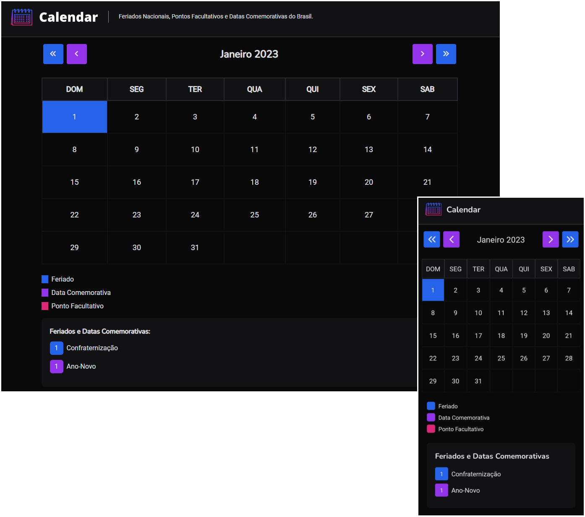

<h1 align="center">
  
</h1>

## 💻 Projeto

O Caledar é um projeto que consiste de três aplicações (API, Web e Mobile) de um calendário que conta com os principais feriados nacionais, datas comemorativas e outras datas especiais do Brasil.

<h1 align="center">
  
</h1>

## ✨ Tecnologias

Esse projeto foi desenvolvido com as seguintes tecnologias:

- [TypeScript](https://www.typescriptlang.org/)
- [Express](https://expressjs.com/pt-br/)
- [React](https://pt-br.reactjs.org/)
- [Tailwind CSS](https://tailwindcss.com/)
- [React Native](https://reactnative.dev/)
- [Expo](https://expo.dev/)
- [date-fns](https://date-fns.org/)

## 🚀 Como executar

- Clone o repositório
- Instale as dependências de cada aplicação com `npm install`
- Faça uma copia dos arquivos `.env.example` para `.env.local` (web) ou para `.env` (api e mobile) e configure suas variáveis de ambiente
- Inicie as aplicações API e Web com `npm run dev`, e a aplicaçao Mobile com `npx expo start`

## 📄 Licença

Esse projeto está sob a licença MIT. Veja o arquivo [LICENSE](LICENSE) para mais detalhes.

---

Desenvolvido por Tiago Faria.
